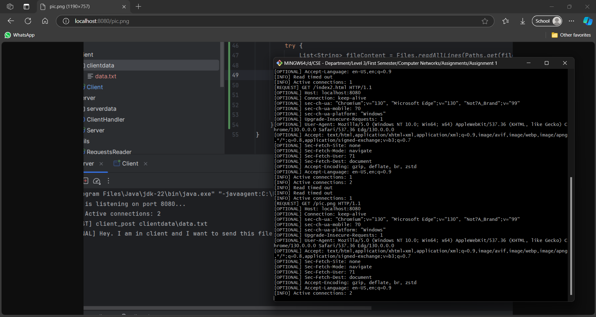

# Introduction to Socket Programming

## **1. Overview**

In this assignment, we implemented a multi-threaded web server that can handle HTTP GET and POST requests. The server was developed to provide hands-on experience in socket programming and understand HTTP protocol basics. The server maintains persistent client connections and handles concurrent requests through multithreading. The main goals were to build a robust server capable of:

- Serving client requests using GET and POST methods.
- Managing client-server communication using sockets.
- Implementing multithreading to handle multiple clients simultaneously.

## **2. Program Architecture**

### **2.1 Organization and Structure**

The program is structured into **classes** that handle **core** functionality:

- **`Server`**: The main class initializes the server, listens for client connections, and delegates processing to worker threads.

```java
public class Server {
    public static void main(String[] args) throws IOException {
        int portNumber = Integer.parseInt(args[0]);
        ServerSocket ss = new ServerSocket(portNumber);
        ThreadGroup clientsGroup = new ThreadGroup("ClientsGroup");
        TimeoutHandler timeoutHandler = new TimeoutHandler(clientsGroup);
        while (!ss.isClosed()) {
            Socket socket = ss.accept();
            new Thread(clientsGroup, new ClientHandler(socket, timeoutHandler)).start();
        }
        ss.close();
    }
}
```

- **`ClientHandler`**: A class responsible for parsing client requests, handling GET and POST operations, and sending appropriate responses.

```java
public class ClientHandler implements Runnable {
    private Socket socket;
    private BufferedReader bf;
    private PrintWriter pr;

    @Override
    public void run() {
        while (true) {
            String request = bf.readLine(); // Reads client request
            String[] requestTokens = request.split(" ");
            String method = requestTokens[0];
            String filePath = requestTokens[1];

            if ("GET".equals(method)) {
                handleGetRequest(filePath);
            } else if ("POST".equals(method)) {
                handlePostRequest(filePath);
            }
        }
    }
}
```

- **`Client`**: The client-side implementation is responsible for establishing a connection with the server, sending HTTP GET and POST requests, and handling responses from the server.

```java
public class Client {
    public static void main(String[] args) throws IOException {
        String serverIp = args[0];
        int portNumber = Integer.parseInt(args[1]);
        Socket s = new Socket(serverIp, portNumber);

        List<String> requests = RequestsParsingHandler.readRequests("requests.txt");
        for (String request : requests) {
            processRequest(request);
        }
    }
}
```

Other **utility** classes:

- **`TimeoutHandler`**: responsible for dynamically calculating the timeout for client connections based on the number of active connections in the server. This helps in managing resources more effectively by adjusting timeouts to maintain server responsiveness as the number of clients fluctuates.

```java
public synchronized int calculateTimeout() {
    int activeConnections = this.threadGroup.activeCount();
    return Math.max(BASE_TIMEOUT / activeConnections, MIN_TIMEOUT);
}
```

- **`RequestsParsingHandler`:** used by the **client** to read and parse incoming HTTP requests from an input file, simulating the process of sending these requests to the server.

```java
public static List<String> readRequests(String filePath) {
    List<String> requests = new ArrayList<>();
    try {
        List<String> fileContent = Files.readAllLines(Paths.get(filePath));
        for (String s : fileContent) {
            if (s.isEmpty()) {
                requests.add(sb.toString());
                sb = new StringBuilder();
            }
        }
    }
    return requests;
}
```

### **2.2 Major Functions and Data Structures**

The code relies on core Java I/O, networking, and data manipulation classes. Major data structures and functions include:

- **`BufferedReader` and `PrintWriter`**: Used for reading from and writing to I/O streams within `ClientHandler`, enabling smooth communication between client and server.
- **`DataInputStream` and `DataOutputStream`**: Used for transmitting binary data efficiently during `POST` and `GET` operations, supporting data integrity across network transfers.
- **`ThreadGroup`**: Organizes and manages individual client threads within the `Server` class, allowing for parallel handling of multiple clients.
- **`Socket` and `ServerSocket`**: Facilitate client-server connections, where `ServerSocket` listens for incoming connections, and `Socket` establishes client connections for data exchange.
- **`handlePostRequest(..)`**: Processes `POST` requests by reading data from the client’s `clientdata` directory and writing it to the server’s `serverdata` directory in the same relative path. This handler ensures data synchronization between client and server directories.
- **`handleGetRequest(..)`**: Manages `GET` requests, retrieving requested files from `serverdata` and sending them back to the client. This handler ensures clients can access server-side files efficiently.

## **3. Approach for Client-Server Handling**

### **3.1 Multi-threading vs. Multi-processing**

In designing our server, we evaluated multi-threading and multi-processing to determine the best approach for handling concurrent client connections.

- **Multi-threading**: This method involves creating multiple threads within the same process to handle different clients concurrently. Each thread shares the same memory space, making data exchange between threads efficient. Multi-threading is particularly beneficial for I/O-bound applications, such as our web server, as it can handle multiple clients without the overhead of creating new processes.

Given these factors, we chose **multi-threading** as our approach for its ability to maintain a high number of concurrent connections and share the same memory space.

### **3.2 Persistent Connections**

Persistent connections, a feature introduced in HTTP/1.1, allow clients to reuse a single connection for multiple requests instead of opening a new connection for each request. This reduces the overhead associated with creating and closing connections repeatedly.

**Implementation Details**:

- **Connection Handling**: Our server is designed to keep connections open after sending a response. This allows clients to send subsequent requests without reconnecting.
- **Timeout Management**: To ensure efficient use of server resources, we implemented a timeout mechanism. If no new request is received within the timeout period, the server closes the connection. This dynamic timeout is configured based on the server load—if the server is idle, it allows longer connection times, while under heavy load, it may close idle connections sooner to free up resources.

## **4. Command Format Descriptions**

### **POST Request:**

A POST request sends file content encoded in Base64 to the server, with a **`\n`** newline character **required** after the request body.

- **Request Format**:
    
    ```
    POST /filename HTTP/1.1\n
    [YOU CAN ADD ANY HEADERS HERE]...\n
    \n
    [Base64 encoded file content]\n
    ```
    
- **Response Format**:
    
    ```
    HTTP/1.1 200 OK\n
    ```
    
- **Example**:
    
    ```
    POST /testfile.txt HTTP/1.1\n
    Content-Length: 36\n
    \n
    U29tZSBjb250ZW50IHRvIGJlIHBvc3RlZC4=\n
    ```
    

### **GET Request:**

A GET request retrieves the specified file from the server. The response includes a **`\0` null** byte at the end of the body to signify the **end** of file content.

- **Request Format**:
    
    ```
    GET /filename HTTP/1.1\r\n
    [YOU CAN ADD ANY HEADERS HERE]...\n
    ```
    
- **Response Format**:
    - If the file was found:
    
    ```
    HTTP/1.1 200 OK\n
    Content-Type: [CONTENT-TYPE]\n
    Content-Length: [CONTENT-LENGTH]\n
    
    [File content (serialized byte array)]\0
    ```
    
    - If the file was not found:
    
    ```
    HTTP/1.1 404 Not Found\n
    Content-Type: text/html\n
    Content-Length: 0\n
    \n
    404 Not Found\n
    ```
    
- **Example**:
    
    ```
    GET /testfile.txt HTTP/1.1
    ```
    

## 5. Running the Server and Client

To execute the server and client applications, follow these commands:

- **Compile the Server and Client codes:**
    
    ```bash
    javac -d . server/*.java client/*.java utils/*.java
    ```
    
- **Running the Server**:
    
    ```bash
    ./my_server <server_port_number>
    ```
    
- **Running the Client**:
    
    ```bash
    ./my_client <server_ip> <server_port_number>
    ```
    
    - Starting two clients in parallel:
        
        .png)
        
    - During the run of the two clients:
    
    .png)
    
    - Starting four clients in parallel:
    
    .png)
    
    - During the run of the four clients:
    
    .png)
    
    - The requests that the clients sent during these runs:
    
    
    

## **Bonus**

## 6. Browser Testing

- We tested the server on multiple web browsers, here are some screenshots from the trial on Microsoft Edge:
    
    
    
- First, this is the data currently on the server:
    
    
    
- Sending GET requests for the data:
    
    
    
    
    
    
    
    
    
    
    
    
    
- If the data wasn’t found:
    
    
    
    
    

## **7. Performance Evaluation**

To assess the performance of our system, we conducted a load test using [**Locust**](https://docs.locust.io/en/stable/installation.html), a scalable load testing tool designed to simulate high user traffic and analyze system behavior under stress.

### **Locust Setup and Execution**

We implemented a custom load testing script, `locustfile.py`, which defines the behavior for each simulated user in the test. Below is the code for `locustfile.py`, which specifies the tasks each user performs:

```python
import base64
from locust import HttpUser, task, between

class MyServerUser(HttpUser):
    wait_time = between(1, 3)

    @task
    def get_request(self):
        self.client.get("/index.html")

    @task
    def post_request(self):
        data = "text"
        encoded_data = base64.b64encode(data.encode()).decode()
        encoded_data += "\n"
        self.client.post("/test_index.html", data=encoded_data,
										        headers={"Content-Type": "text/plain"})
```

To run this test, navigate to the directory where `locustfile.py` is located and execute the following command:

```bash

locust -f locustfile.py --host http://localhost:8080
```

Once Locust is running, open the Locust web interface at `http://localhost:8089` to control the test parameters (number of users, spawn rate) and observe real-time metrics.

### **Test Observations and Analysis**

During the test, we monitored various performance metrics, including request rate (RPS), response times, and user count, as illustrated by the charts below:


1. **Total Requests per Second (RPS)**:
    - The **green** line in the chart shows the rate of requests being processed per second. We observed an initial steady increase in RPS, with occasional dips possibly due to intermittent connection issues.
    - Notable **failures** (marked in red) occurred around the same 20-second interval, where the target machine actively refused connections. This might be attributed to a **temporary** overload on the server, leading it to reject new requests. Such failures indicate potential bottlenecks when handling bursts in traffic.
        
        
        
2. **Response Times (ms)**:
    - The response time chart captures both the **50th percentile** (median) and the **95th percentile** response times.
    - We observed that response times fluctuated, with occasional spikes reaching as high as 40,000 ms, indicating latency under high load. These delays could be due to resource contention as the number of users increased. Consistent increases in response times at higher percentiles suggest the system may struggle with handling peak loads efficiently.
    - Lower response times in the median range suggest that while average performance remains manageable, some requests experience significant delays during high concurrency.
3. **Number of Users**:
    - As we incrementally added users, we observed a proportional increase in RPS and response times, reflecting the system's throughput and latency. The increasing number of users also correlated with more frequent failures, emphasizing the impact of high concurrency on stability.

### **Observations on Throughput and Delay**

- **Throughput**: Our system handled up to approximately 300 RPS consistently before reaching points of failure. This indicates a fair level of scalability but suggests the server might benefit from optimizations to support higher throughput under stress.
- **Delay**: As user count increased, the system showed noticeable delays in response times, especially for the higher percentiles. This behavior suggests that while average requests are processed quickly, outliers face substantial delays under peak load.

### **Detailed Report**

For a **more detailed view** of the performance results, including individual request success rates, latency distributions, and additional analysis, please refer to the full Locust report generated at the end of the test [**here**](./locust-results/locust_report.html).

### **Screenshots**

Below are screenshots taken during the test, including snapshots of active user simulations.


## **8. Assumptions**

- The server and client must be run in the same directory structure as described in the source code.
- In **Client** class, input requests are parsed line by line from an external file called `requests.txt`, with empty lines indicating the end of each request.
- To align with typical HTTP conventions, we modified the request format in `requests.txt` from the assignment’s original `client_post` and `client_get` commands to `POST` and `GET`.
    - Example of requests file:
        
        ```
        POST data.txt
        Host: localhost
        Content-Type: application/octet-stream
        
        POST pic.png
        Host: localhost
        Content-Type: image/png
        
        POST index.html
        Host: localhost
        Content-Type: xml
        Connection: close
        
        GET data2.txt
        
        GET pic2.png
        
        GET index2.html
        
        GET index3.html
        ```
        
- The client does not require input for `hostname` and `port` in each request. Instead, these values are passed as arguments when the client program is executed, establishing the server connection details once, at startup, rather than within individual requests.
- The client’s `POST` requests read data from files within a designated directory, `clientdata`. When a `POST` request is made, the data is sent to the server and saved to an equivalent relative path under the `serverdata` directory on the server side. This structure maintains a mirrored directory organization between client and server storage.

## **Contributors:**

- Ahmed Youssef
- Mohamed Mahfouz